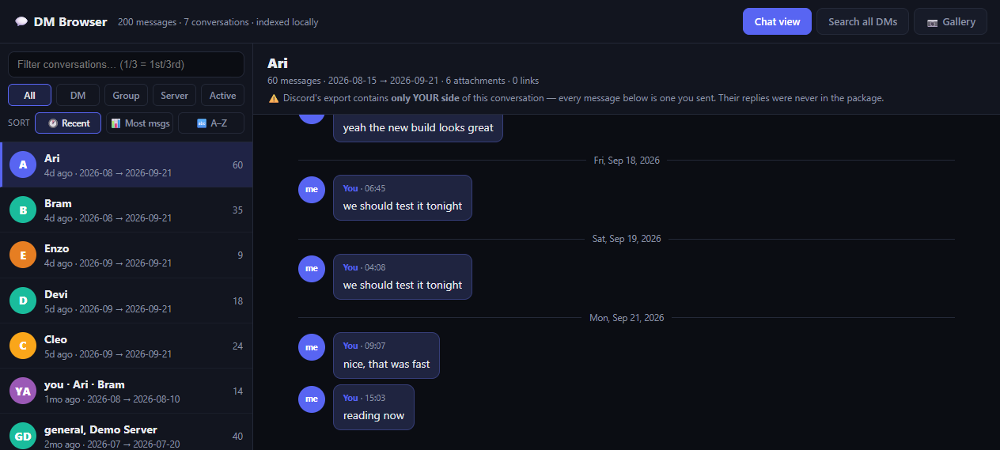
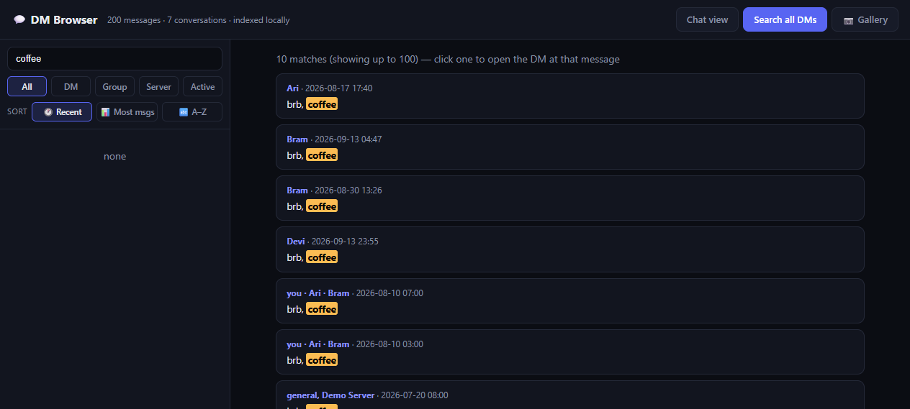
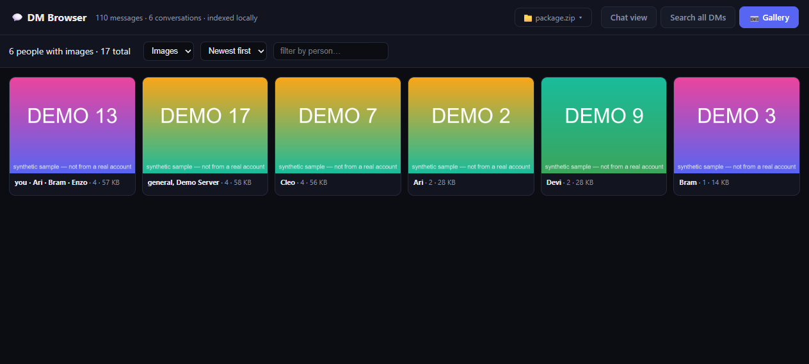
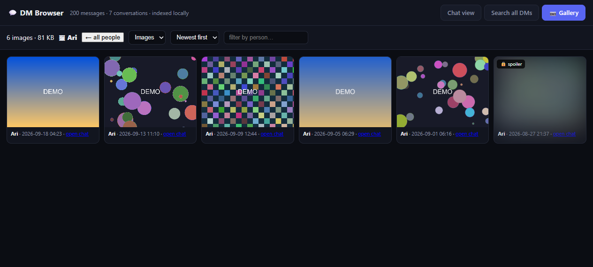
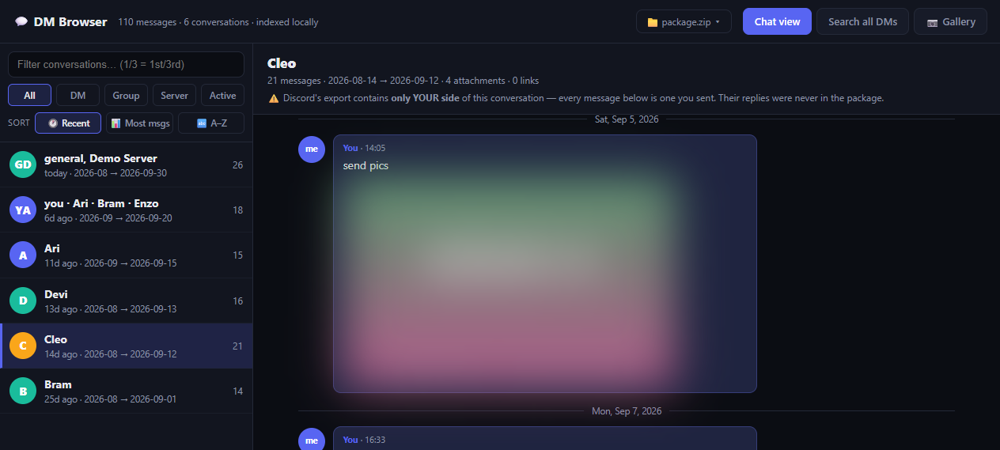

# 💬 Discord Export Viewer — read your own Discord data package

> Browse, search, and view media from your **own** Discord data export. 100% local, no tokens, no install.

A private, offline web app for browsing your **Discord data package** (the
`request_data.zip` Discord emails you when you request your data):

- 📖 **Chat view** — every conversation, day separators, links clickable
- 🔎 **Instant full-text search** across every message (SQLite FTS5, prefix matching)
- 📷 **Per-person gallery** — click a person, see their media wall; images/videos/audio/files
- 🖼️ **Attachments cached locally** — including spoiler-tagged ones (shown blurred until you click)
- 📁 **Point at any package from the web UI** — no config files; re-point anytime via the 📁 button
- 🔒 **100% local.** No account, no tokens, no internet needed after the optional attachment download.

Works on Windows, macOS, Linux. Requires **Python 3.8+** (nothing else to install).

---

## What you get

### Chat view — every conversation, honest one-sided labels


### Instant full-text search over every message


### Gallery — per person, newest first



### Spoiler-aware previews — blurred until you click


*(All screenshots use a synthetic demo package — fake users, generated images.)*

## Quick start

1. **Request your data** in Discord:
   `User Settings → Privacy & Safety → Request Data` (takes hours–days; you get an email with `request_data.zip`)
2. **Unzip it.** Inside there's a folder containing `Messages/`, `Account/`, `Servers/` — that's your *package*.
3. **Run it:**
   - **Windows:** double-click `Start DM Browser.bat`
   - **anywhere:** `python server.py` → open <http://127.0.0.1:5055>
4. First run? The app opens a **setup screen** — click **📂 Choose folder…**, browse to your unzipped package (the folder with `Messages/` inside), click **Use this folder**. It indexes in seconds and you're browsing. No config files needed.

Nothing else to install, nothing ever leaves your machine.

### Optional but recommended: cache your attachments

Without this step the chat still shows *what* was attached (with the original
filenames) but can't display it. With it, images/videos render inline:

```bash
python fetch_attachments.py            # all of them (can be GBs — resumable, re-run safe)
python fetch_attachments.py --sample 20   # try 20 first
```

Re-run `python server.py` after fetching so the gallery lights up.

---

## Honest limitations (read this first)

- **Your export contains only the messages *you* sent.** Discord builds the
  package that way on purpose (privacy). DMs in here are one-sided: you'll see
  what you wrote to each person, never their replies. Every bubble is labelled
  **"You"** — that's not a bug, that's Discord's export.
- **Old attachments expire.** Files age off Discord's CDN; anything too old
  404s and is shown as `⛔️ expired` instead of silently missing.
- Spoiler tags survive the export as `SPOILER_` in the filename — the browser
  blurs those previews until you click.

## Files

| file | what it does |
|---|---|
| `build_dm_db.py` | parses the package → `dm.db` (SQLite + FTS5). Re-run after a new export. |
| `fetch_attachments.py` | threaded, resumable CDN downloader → `attachments/` + registry in `dm.db` |
| `server.py` | tiny stdlib-only HTTP server + the single-page UI (`index.html`) |
| `Start DM Browser.bat` | Windows launcher (detects a running server, opens browser) |

## Config

`config.json` is created for you when you pick a package in the app. To pre-seed it (or override the port):
```json
{"package": "C:\\path\\to\\package", "port": 5055}
```
Env overrides: `DISCORD_PACKAGE`, `DM_PORT`, `DM_DB`, `DM_ATTACH_DIR`.

## Sharing with a friend?

Zip this whole folder, hand it over — they just need Python and their own
unzipped data package. Nothing on your machine (no `dm.db`, no `attachments/`)
is needed by them; the first `Start DM Browser.bat` run builds everything fresh.

MIT license — do whatever.
